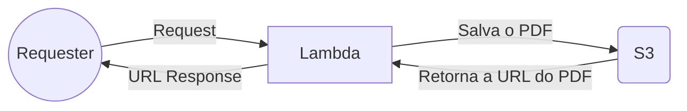
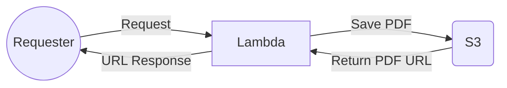

# Lambda Pdf Generator

Este projeto foi desenvolvido a fim de otimizar a funcionalidade de geração de PDFs.

Para que a conversão de HTML para PDF possa funcionar é são utilizados os pacotes:

- chrome-aws-lambda
> Pacote com o binário do chromium, com ele é possível usar o chrome headless para a renderização do html na AWS.
- puppeteer-core
> Pacote responsável por ler o HTML renderizado e criar o PDF a partir do mesmo, o puppeteer-core não faz o download do chrome, que no nosso caso não precisamos.
- aws-sdk
> Pacote de SDK da AWS usado no projeto para acesso ao S3.
## Instalação

Após baixar o projeto você precisará rodas os seguintes comandos para instalar as dependências:

- `npm install`
> Este comando instalará todas as dependências do projeto.

## Configuração do serverless
O projeto conta com o framework Serverless, ele automatiza a criação e deploy da stack da aplicação na AWS.  
A stack para deploy da aplicação já está configurada, mas ainda é necessário instalar o framework com o seguinte comando:

- `npm install -g serverless`
> Este comando instalará o serverless, necessário para a criação e deploy da stack.
# Deploy

Agora que temos a aplicação e o Serverless instalados, precisamos informar para o serverless credenciais accessKeyId e secretAccessKey da AWS para conceder a ele a permissão para criar a stack.
- `serverless config credentials --provider aws --key 'key_aqui' --secret 'secret_key_aqui'`
> Este comando salvará em ~/.aws/credentials nossas credenciais para serem usadas.
Com as credenciais configuradas já é possível fazermos o deploy para produção com o seguinte comando:
- `serverless deploy --stage prod`
> O comando fará deploy para produção.

## Configurações adicionais
Renomeie os arquivos:
- .env.example -> .env
> Nele é necessário configurar as váriaveis de ambiente.
- serverless.yml.example -> serverless.yml
> Nele é necessário configurar os serviços que serão levantados na AWS.
## Fluxo de funcionamento

---

# Lambda Pdf Generator

This project was developed to optimize the functionality of PDF generation.

To enable HTML to PDF conversion, the following packages are used:

- chrome-aws-lambda
> Package with the Chromium binary, which allows using headless Chrome for HTML rendering on AWS.
- puppeteer-core
> Package responsible for reading the rendered HTML and creating the PDF from it. Puppeteer-core does not download Chrome, which is not needed in our case.
- aws-sdk
> AWS SDK package used in the project for S3 access.

## Installation

After downloading the project, you need to run the following commands to install the dependencies:
- `npm install`
> This command will install all project dependencies.

## Serverless Configuration

The project utilizes the Serverless framework, which automates the creation and deployment of the application stack on AWS.

The stack for deploying the application is already configured, but you still need to install the framework with the following command:
- `npm install -g serverless`
> This command will install Serverless, which is necessary for stack creation and deployment.

# Deploy

Now that we have the application and Serverless installed, we need to provide the accessKeyId and secretAccessKey credentials from AWS to Serverless, granting it permission to create the stack.
- `serverless config credentials --provider aws --key 'key_here' --secret 'secret_key_here'`
>This command will save our credentials to be used in ~/.aws/credentials.

With the credentials configured, you can deploy to production using the following command:
- `serverless deploy --stage prod`
> The command will deploy to production.

## Additional Configurations

Rename the files:
- .env.example to .env
> In this file, you need to configure the environment variables.
- serverless.yml.example to serverless.yml
> In this file, you need to configure the services that will be provisioned on AWS.

## Workflow

