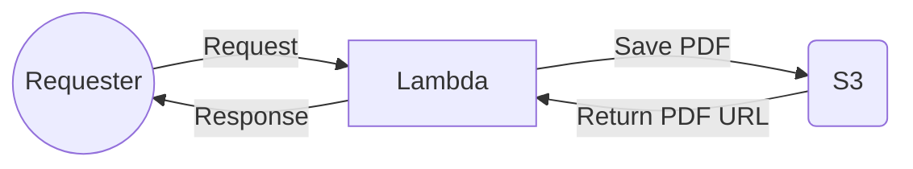

# Lambda Pdf Generator

This project was developed to optimize the functionality of PDF generation.

To enable HTML to PDF conversion, the following packages are used:

- chrome-aws-lambda
> Package with the Chromium binary, which allows using headless Chrome for HTML rendering on AWS.
- puppeteer-core
> Package responsible for reading the rendered HTML and creating the PDF from it. Puppeteer-core does not download Chrome, which is not needed in our case.
- aws-sdk
> AWS SDK package used in the project for S3 access.

## Installation

After downloading the project, you need to run the following commands to install the dependencies:
- `npm install`
> This command will install all project dependencies.

## Serverless Configuration

The project utilizes the Serverless framework, which automates the creation and deployment of the application stack on AWS.

The stack for deploying the application is already configured, but you still need to install the framework with the following command:
- `npm install -g serverless`
> This command will install Serverless, which is necessary for stack creation and deployment.

# Deploy

Now that we have the application and Serverless installed, we need to provide the accessKeyId and secretAccessKey credentials from AWS to Serverless, granting it permission to create the stack.
- `serverless config credentials --provider aws --key 'key_aqui' --secret 'secret_key_aqui'`
>This command will save our credentials to be used in ~/.aws/credentials.

With the credentials configured, you can deploy to production using the following command:
- `serverless deploy --stage prod`
> The command will deploy to production.

## Additional Configurations

Rename the files:
- .env.example to .env
> In this file, you need to configure the environment variables.
- serverless.yml.example to serverless.yml
> In this file, you need to configure the services that will be provisioned on AWS.

## Workflow

